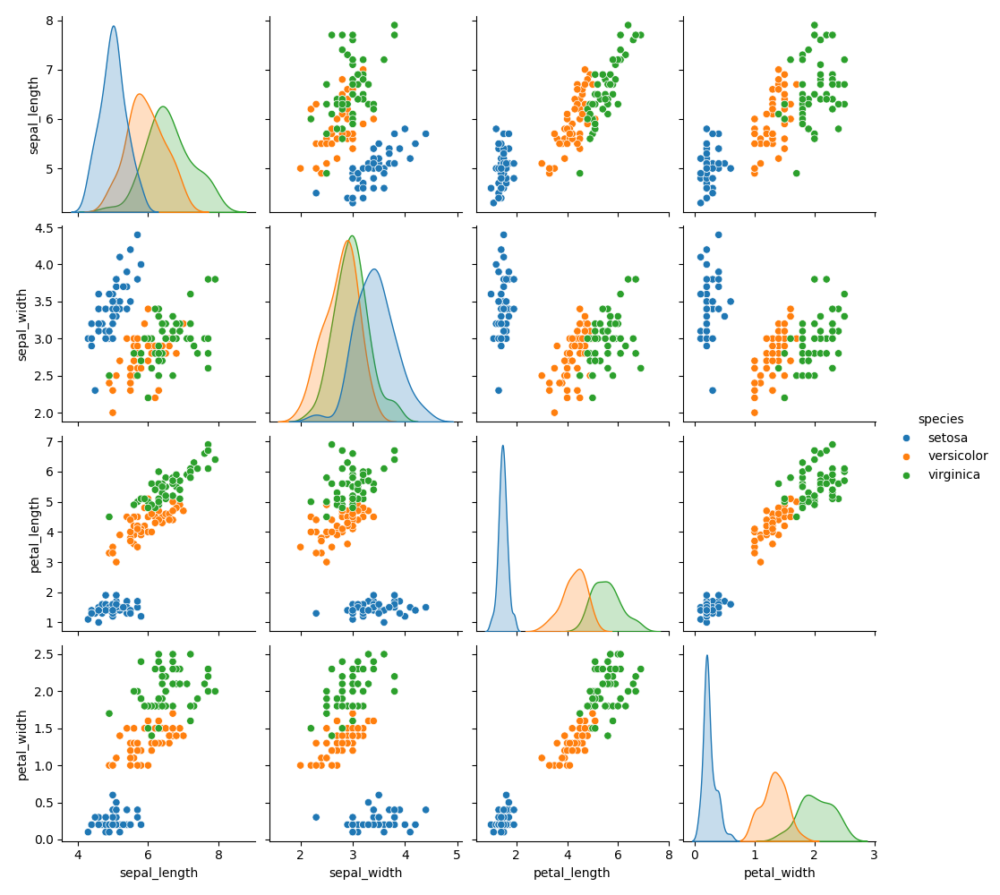
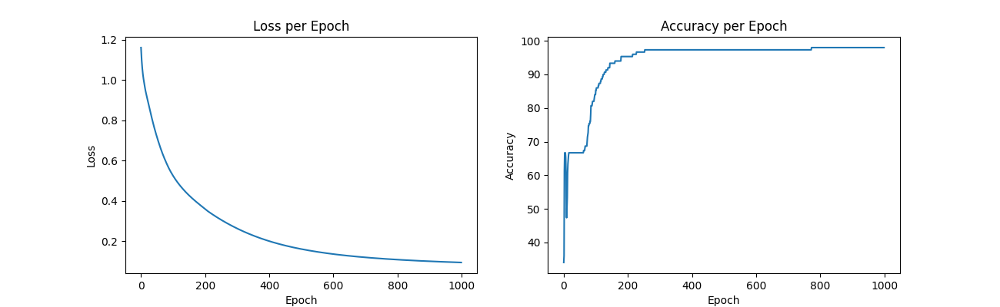
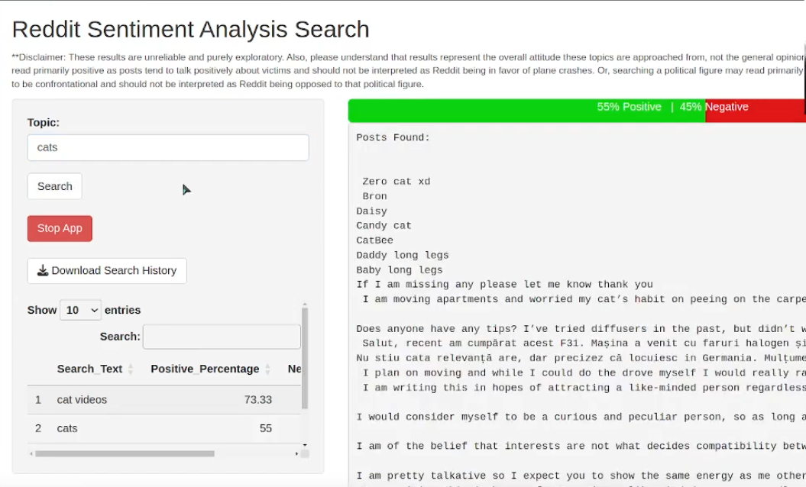
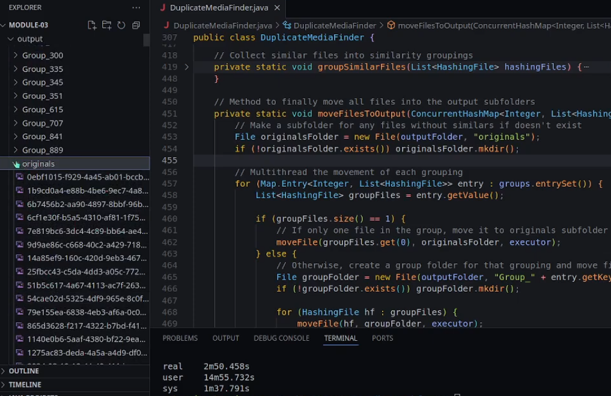
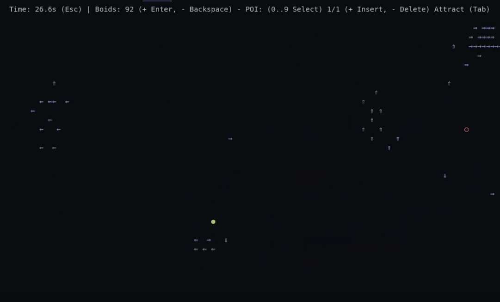
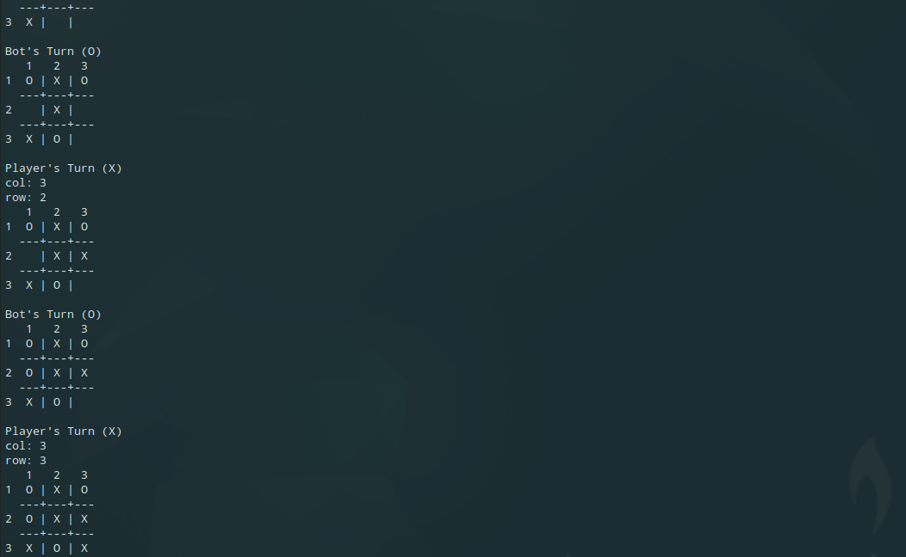
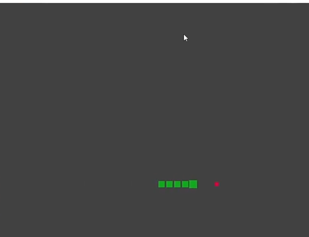
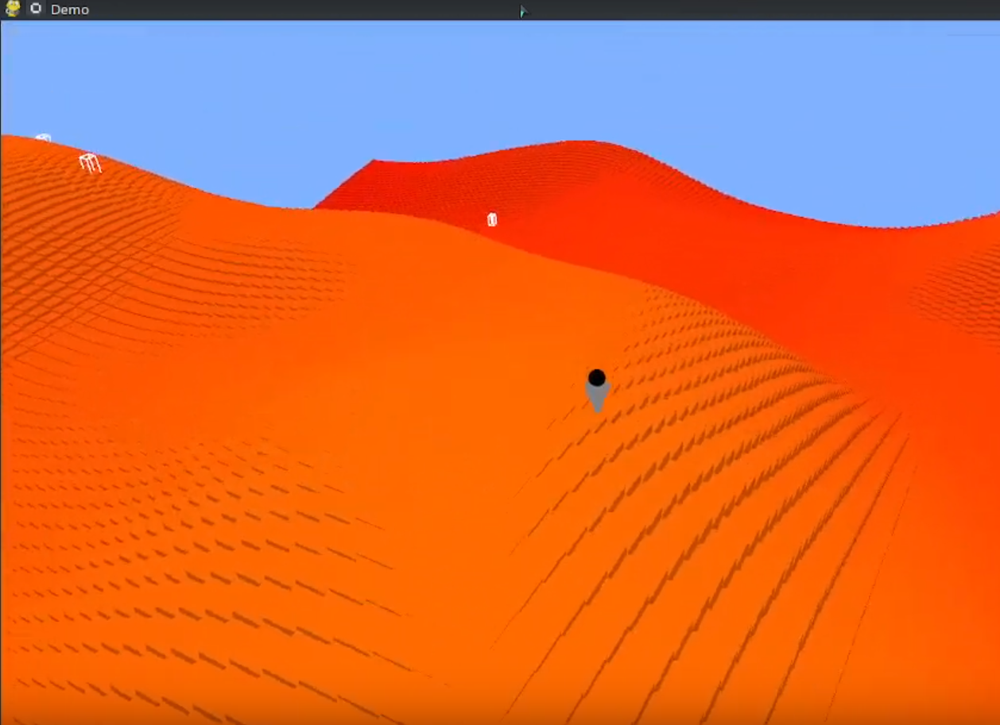
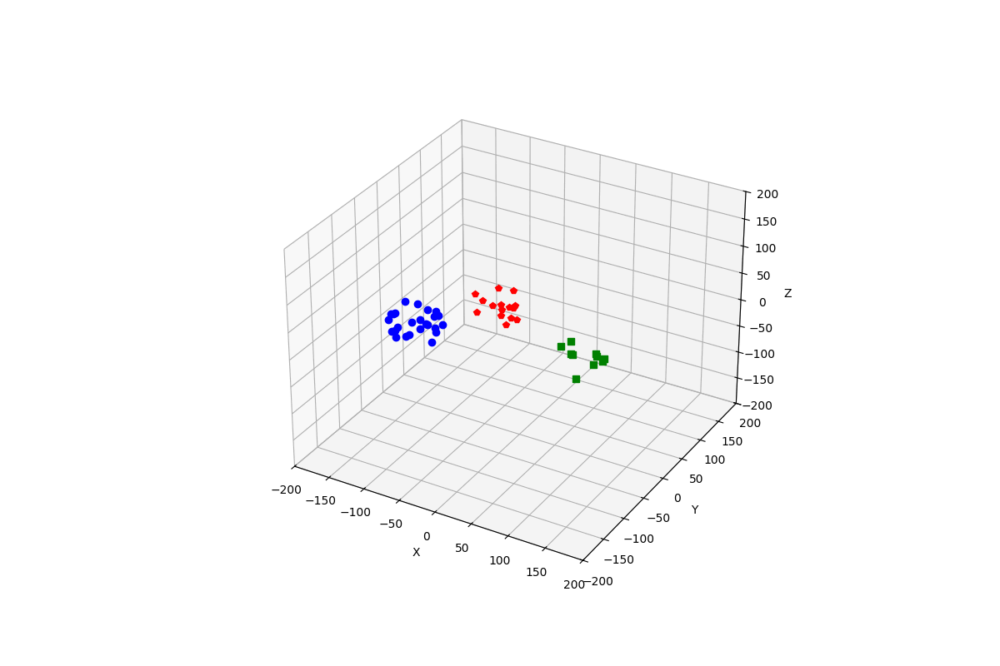
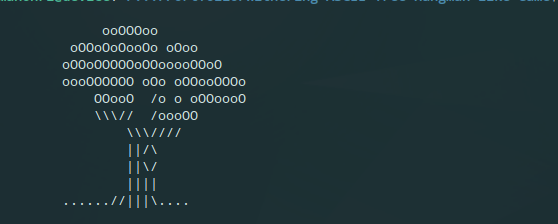

# Welcome!

Thank you for visiting my portfolio repository.

This collection showcases the various projects I have completed for volunteer positions, college courses, personal learning, and just for fun. 

## About This Repository

This repository includes projects ranging from machine learning models to open world terminal games. It highlights my technical capability as well as my approach to solving complex problems. 

## How to Navigate

Simply click on the project listed below to navigate to a brief overview of it. 

All project source code can be directly navigated to from this root directory or from the project overview.

## Projects
Highlights
- [Semi-Fullstack Inventory Management Dashboard](#semi-fullstack-inventory-management-dashboard)
- [Iris Dataset ANN](#iris-dataset-ann)
---
Utility
- [Reddit Sentiment Analysis Search](#reddit-sentiment-analysis-search)
- [Duplicate Media File Identifier](#duplicate-media-file-identifier)
- [Local Variable Trace for Python](#local-variable-trace-for-python)
---
Fun
- [Interactive Terminal Boids Simulation](#interactive-terminal-boids-simulation)
- [2D Terminal Swarm Survival Game](#2d-terminal-swarm-survival-game)
- [TicTacToe](#tictactoe)
- [Snake Game](#snake-game)
---
Under Construction
- [3D OpenGL Swarm Survival Game](#3d-opengl-swarm-survival-game)
- [Boids in Matplotlib](#boids-in-matplotlib)
- [Withering ASCII Tree Hangman-like Game](#withering-ascii-tree-hangman-like-game)

     

### Semi-Fullstack Inventory Management Dashboard 

**Summary**: This is a web dashboard hosted on a FastAPI / Uvicorn Python backend. It integrates with an Airtable inventory system to provide data insights and streamlined actions on a webpage. I wrote this during my time volunteering at the Northern Colorado Wildlife center to let volunteers report inventory purchases / usages from different machines. 
  

 

### Iris Dataset ANN

**Summary**: This was my first hands on experience with ANNs. It's a simple exercise from a certification I am currently working on (A Deep Understand of Deep Learning by Mike Cohen). The network itself is built with the torch library and consists of 3 layers (4 input, 64 hidden, 3 output) with a relu connection between each.

 

### Reddit Sentiment Analysis Search

**Summary**: This was written in a series of 1 week projects for a college course. It was written to explore the basics of the R language. It utilizes Reddit's API to query the top 100 posts related to the user's input, performs a simple sentiment analysis of each, and returns a percentage bar showing the negative to positive proportions. The user can then search through their recent search history and compare results as well as download the session history.

 

### Duplicate Media File Identifier

**Summary**: This was written in a series of 1 week projects for a college course. It was written to explore the basics of the Java language as well as help me maintain my thousands of personal keepsake photos. It uses a simple hashing technique to identify duplicate and similar media files. It can also identify similarities between videos and photos. 

 

### Local Variable Trace for Python

**Summary**: This is a very simple utility script I use during Python debugging. It's an implementation of sys.settrace() that prints out a trace table of all local variables in the script. 

 

### Interactive Terminal Boids Simulation

**Summary**: This was written in a series of 1 week projects for a college course. It was written to explore the basics of the Rust language. It runs a simple boids simulation in the terminal with frame buffering logic and gives various controls to the user for interacting with the boids. The user can place and move points of interest that can be individually toggled between repel and attract. These POIs along with the boids themselves can be dynamically spawned and despawned by the user. 

 

### 2D Terminal Swarm Survival Game

**Summary**: This was written as my final project in my intro to C# college course. It utilizes frame buffering logic to run exclusively in the terminal and includes menus that the user can navigate with the arrow keys. It utilizes a randomly seeded procedurally generated world with collision detection and ascii art. The user is given one minute to run and survive the growing population of unique monsters that hunt them down.  

 

### TicTacToe

**Summary**: This was a quick personal challenge for myself. It utilizes the minimax algorithm to always tie or beat the player in a game of tictactoe.

 

### Snake Game

**Summary**: This was written in a series of 1 week projects for a college course. It was written to explore the basics of the C++ language. Using an SDL window, it runs a classic game of snake. 

 

### 3D OpenGL Swarm Survival Game

**Summary**: This was written in a series of 1 week projects for a college course. It was written to explore the basics of working in a game development framework. I chose pygame and decided to take it a step further with pyopengl. It was origionally just a 3D world you could walk around in, but has since been moved to "under construction" as I'm adding actual gameplay features to it. The 3D world is procedurally generated and is highly optimized (as far as I can in raw Python) to display a chunked map with chunks being generated and rendered in async multiprocesses. 

 

### Boids in Matplotlib

**Summary**: This was my first ever attempt at a boids simulation. It has been moved to "under construction" because it needs a total rehaul after all these years. It populates "flocks" of boids that interact in a matplotlib 3d graph. 

 

### Withering ASCII Tree Hangman-like Game

**Summary**: This is a work in progress I occasionally come back to. I haven't dropped it yet because I like the concept. At the core, it's a simply hangman game. Except, it handles incorrect guesses by withering an ASCII tree.

