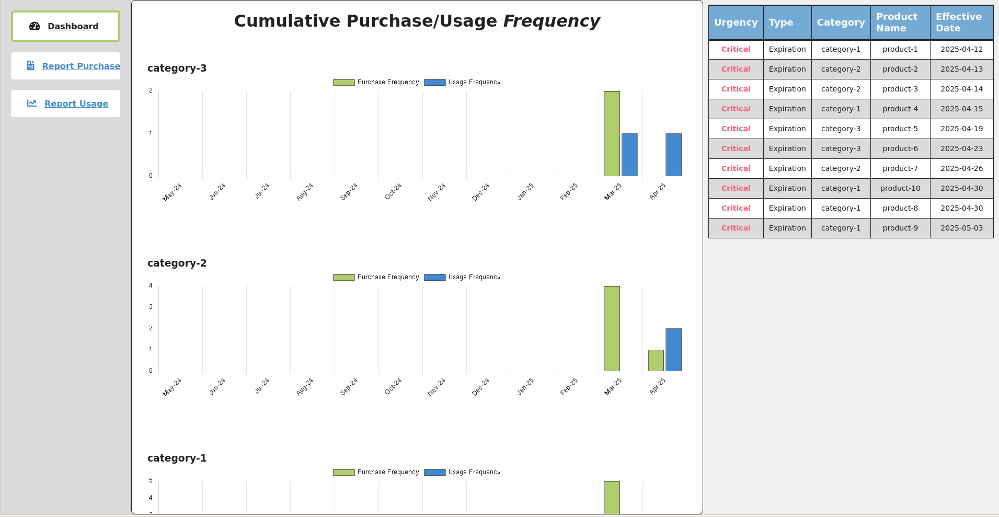

# Welcome!

Thank you for visiting my portfolio repository.

This collection showcases the various projects I have completed for volunteer positions, college courses, and personal learning / exploration. 

## About This Repository

This repository includes projects ranging from machine learning models to open world terminal games. It highlights my technical capability as well as my approach to solving complex problems. 

## How to Navigate

Click on the project title below for a detailed overview. 

All project source code can be directly navigated to from this root directory.

## Projects
Data Science and Machine Learning
- [Iris Dataset ANN](#iris-dataset-ann)
- [Semi-Fullstack Inventory Management Dashboard](#semi-fullstack-inventory-management-dashboard)
- [Reddit Sentiment Analysis Search](#reddit-sentiment-analysis-search)
---
Utility
- [Duplicate Media File Identifier](#duplicate-media-file-identifier)
- [Local Variable Trace for Python](#local-variable-trace-for-python)
---
Games
- [Interactive Terminal Boids Simulation](#interactive-terminal-boids-simulation)
- [2D Terminal Swarm Survival Game](#2d-terminal-swarm-survival-game)
- [TicTacToe](#tictactoe)
- [Snake Game](#snake-game)
---
Under Construction
- [3D OpenGL Swarm Survival Game](#3d-opengl-swarm-survival-game)
- [Boids in Matplotlib](#boids-in-matplotlib)
- [Withering ASCII Tree Hangman-like Game](#withering-ascii-tree-hangman-like-game)

     

---

### Iris Dataset ANN

**Summary**: This ANN is built with the torch library and has 4 input nodes, 64 hidden layer nodes, and 3 output nodes. The 4 input nodes correspond to the 4 features of the dataset; sepal length, sepal width, petal length, and petal width. The 3 output nodes correspond with the target value that could be classified into three types of iris; setosa, versicolor, and virginica. I used ReLU activation functions between each layer because in training, the ReLU activation function trained slightly quicker than sigmoid or tanh. Additionally, ReLU was logically a good fit for the nature of the input values which fell in a small positive range. In the end, the network and dataset were both so small that I got good results with everything I tried. I simply settled on ReLU for its simplicity. At around 800 epochs, the model had almost 100% accuracy when predicting the type of iris from the given features. 

  

 

---

### Semi-Fullstack Inventory Management Dashboard 

**Summary**: This is a web dashboard hosted on a FastAPI / Uvicorn Python backend. It integrates with an Airtable inventory system to provide data insights and streamlined actions on a webpage. Requests are passed back and forth between the application frontend and Airtable, processing the data on the Python backend to handle errors and format data. I wrote this during my time volunteering at the Northern Colorado Wildlife center to let volunteers report inventory purchases / usages from different machines. 

 

---

### Reddit Sentiment Analysis Search

**Summary**: This script utilizes Reddit's API to query the top 100 posts related to the user's input, performs a simple sentiment analysis of each, and returns a percentage bar showing the negative to positive proportions. The user can then search through their recent search history and compare results as well as download the session history.

 

---

### Duplicate Media File Identifier

**Summary**: This was written to help me maintain my thousands of personal keepsake photos. It uses a simple hashing technique to identify duplicate and similar media files. It can also identify similarities between videos and photos. It starts be recursively reading through an input folder and reading each file into a HashingFile object that holds its location and hash value. From here, all hashed values are compared in a Burkhard-Keller tree where their distance can be calculated with a Hamming distance function. Files that are found to be similar are grouped into folders while unique files are placed in an original folder. The user can then manually move files around and discard duplicates. 

 

---

### Local Variable Trace for Python

**Summary**: This is a very simple utility script I use during Python debugging. It's an implementation of sys.settrace() that prints out a trace table of all local variables in the script. 

 

---

### Interactive Terminal Boids Simulation

**Summary**: This runs a boids simulation in the terminal with frame buffering logic and gives various controls to the user for interacting with the boids. The user can place and move points of interest that can be individually toggled between repel and attract. These POIs along with the boids themselves can be dynamically spawned and despawned by the user. 

 

---

### 2D Terminal Swarm Survival Game

**Summary**: This utilizes frame buffering logic to run exclusively in the terminal and includes menus that the user can navigate with the arrow keys. It utilizes a randomly seeded procedurally generated world with collision detection and ascii art. The user is given one minute to run and survive the growing population of unique monsters that hunt them down.  

 

---

### TicTacToe

**Summary**: This utilizes the minimax algorithm to always tie or beat the player in a game of tictactoe. It displays in the terminal and takes in a column and row value for each player turn.

 

---

### Snake Game

**Summary**: This uses an SDL window to run a classic game of snake. 

 

---

### 3D OpenGL Swarm Survival Game

**Summary**: This was originally just a 3D world made with pyopengl on the pygame framework that you could walk around in, but has since been moved to "under construction" as I'm adding actual gameplay features to it. The 3D world is procedurally generated and is highly optimized (as far as I can in raw Python) to display a chunked map with chunks being generated and rendered in async multiprocesses. 

 

---

### Boids in Matplotlib

**Summary**: This was my first ever attempt at a boids simulation. It has been moved to "under construction" because it needs a total rehaul after all these years. It populates "flocks" of boids that interact in a matplotlib 3d graph. Boid objects follow over simplified behaviors and are then plotted in the graph with the graph being refreshed every loop.

 

---

### Withering ASCII Tree Hangman-like Game

**Summary**: This is a work in progress I occasionally come back to. I haven't dropped it yet because I like the concept. At the core, it's a simply hangman game. Except, it handles incorrect guesses by withering an ASCII tree. When the user guesses incorrectly, random leaf characters are replaced to give the effect of the tree dying. 

